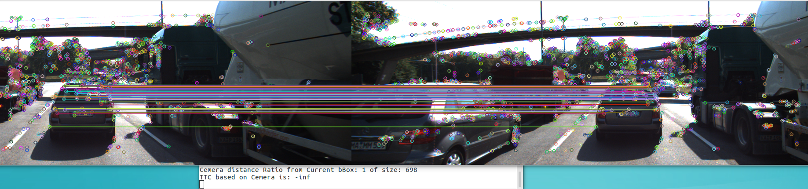

## FP.1 : Match 3D Objects
In camFusion_Student.cpp matchBoundingBoxes()function, it loop all the matches to the corresponding frame to check if the bBox contains the matched point, 
```
    for (auto it = matches.begin(); it != matches.end(); ++it) {
        //KeyPoint coordinate
        cv::Point query = prevFrame.keypoints[it->queryIdx].pt;
        cv::Point train = currFrame.keypoints[it->trainIdx].pt;

        //store the bboxes IDs for which each point belongs to, one ptr may result in multiple bboxes.
        std::vector<int> query_id, train_id; //inside the iterator!

        //extract the bbox IDs which contains the keypoints for the previous frame
        for(auto it2=prevFrame.boundingBoxes.begin();it2!=prevFrame.boundingBoxes.end();++it2) {
            if(it2->roi.contains(query)) {
                query_id.push_back(it2->boxID);
            }
        }

        //extract the bbox IDs which contains the keypoints for the currents frame
        for(auto it2=currFrame.boundingBoxes.begin();it2!=currFrame.boundingBoxes.end();++it2) {
            if(it2->roi.contains(train)) {
                train_id.push_back(it2->boxID);
            }
        } 
```
then a 2D array to store the (repeated)scores of all above possiable paris
```
        if(query_id.size() && train_id.size()) {
            for(int x : query_id) {
                for(int y : train_id) {
                    ab[x][y] += 1;
                }
            }            
        }
```
lastly traverse the 2D array by row(from previous frame), update the maxium value and extract the index for the paired(current frame) bbox ID,
and finally fille the map.
```
for(int i=0;i<l_prevBbox;i++) {
        int curr_idx = 0;
        int max_c = 0;
        for(int j=0;j<l_currBbox;j++) {
            if(ab[i][j] > max_c) {
                max_c = ab[i][j]; 
                curr_idx = j;
            }
        }
            bbBestMatches[i] = curr_idx;
            cout<<"Previous bbox#: " << i << " matched --> Current bbox#： "<< bbBestMatches[i] << endl;
```

## FP.2 : Compute Lidar-based TTC
In camFusion_Student.cpp computeTTCLidar()function, based on the previous execises, use median Lidar points instead of mean which is more affected by the outlier
```
    for(auto it=lidarPointsPrev.begin();it!=lidarPointsPrev.end();it++) {
            temp_px.push_back(it->x);       
    }
    std::sort(temp_px.begin(), temp_px.end());
    medIndex = floor(temp_px.size() / 2.0);
    median_Prev_x = temp_px.size() % 2 ? (temp_px[medIndex-1] + temp_px[medIndex]) / 2 : temp_px[medIndex];

    for(auto it=lidarPointsCurr.begin();it!=lidarPointsCurr.end();it++) {
            temp_cx.push_back(it->x);    
    }
    if(temp_px.size() && temp_cx.size()) {
        std::sort(temp_cx.begin(), temp_cx.end());
        medIndex = floor(temp_cx.size() / 2.0);
        median_Curr_x = temp_cx.size() % 2 ? (temp_cx[medIndex-1] + temp_cx[medIndex]) / 2 : temp_cx[medIndex];
 ```
 
## FP.3 : Associate Keypoint Correspondences with Bounding Boxes
In camFusion_Student.cpp clusterKptMatchesWithROI() function, first shrink the current and previous bBox:
```
    smallerBox_prev.x = boundingBox_prev.roi.x + shrinkFactor * boundingBox_prev.roi.width / 2.0;
    smallerBox_prev.y = boundingBox_prev.roi.y + shrinkFactor * boundingBox_prev.roi.height / 2.0;
    smallerBox_prev.width = boundingBox_prev.roi.width * (1 - shrinkFactor);
    smallerBox_prev.height = boundingBox_prev.roi.height * (1 - shrinkFactor);

    smallerBox_curr.x = boundingBox_curr.roi.x + shrinkFactor * boundingBox_curr.roi.width / 2.0;
    smallerBox_curr.y = boundingBox_curr.roi.y + shrinkFactor * boundingBox_curr.roi.height / 2.0;
    smallerBox_curr.width = boundingBox_curr.roi.width * (1 - shrinkFactor);
    smallerBox_curr.height = boundingBox_curr.roi.height * (1 - shrinkFactor);
```
then filter out the Matched KeyPoints which both contains in the corresponding frame bBox:
```
    for(auto it = kptMatches.begin();it!=kptMatches.end();it++) {
        if(smallerBox_prev.contains(kptsCurr[it->trainIdx].pt) && smallerBox_curr.contains(kptsPrev[it->queryIdx].pt)) {
            //update the bBox kptMatches propertity
            match_in_roi.push_back(*it);
        }
    }
```
then compute the mean distance for the matches within the bBox above, 
lastly filter out the Matched KeyPoints whose distance is under the threshold(within a distance).
```
    for(auto it=match_in_roi.begin();it!=match_in_roi.end();it++) {
        double temp_dist;
        cv::KeyPoint prev_kpt = kptsPrev.at(it->queryIdx);
        cv::KeyPoint curr_kpt = kptsCurr.at(it->trainIdx);
        temp_dist = cv::norm(prev_kpt.pt - curr_kpt.pt);
        //cout<<"current distance "<< temp_dist<<endl;
        if(temp_dist < ratio_dis_thresh * mean_distance) {
            boundingBox_curr.kptMatches.push_back(*it);
        }
```

## Compute Camera-based TTC
make a nested for loop to cpmpute all the ratio for the distance of 2 matched keypoints in partner frame bBox,
```
    for (auto it1 = kptMatches.begin(); it1 != kptMatches.end() - 1; ++it1)
    { // outer kpt. loop

        // get current keypoint and its matched partner in the prev. frame
        cv::KeyPoint kpOuterCurr = kptsCurr.at(it1->trainIdx);
        cv::KeyPoint kpOuterPrev = kptsPrev.at(it1->queryIdx);

        for (auto it2 = kptMatches.begin() + 1; it2 != kptMatches.end(); ++it2)
        { // inner kpt.-loop

            double minDist = 100.0; // min. required distance

            // get next keypoint and its matched partner in the prev. frame
            cv::KeyPoint kpInnerCurr = kptsCurr.at(it2->trainIdx);
            cv::KeyPoint kpInnerPrev = kptsPrev.at(it2->queryIdx);

            // compute distances and distance ratios
            double distCurr = cv::norm(kpOuterCurr.pt - kpInnerCurr.pt);
            double distPrev = cv::norm(kpOuterPrev.pt - kpInnerPrev.pt);

            if (distPrev > std::numeric_limits<double>::epsilon() && distCurr >= minDist)
            { // avoid division by zero

                double distRatio = distCurr / distPrev;
                distRatios.push_back(distRatio);
            }
        } // eof inner loop over all matched kpts
    }
```
then get the median ratio and compute TTC
```
    std::sort(distRatios.begin(), distRatios.end());
    long medIndex = floor(distRatios.size() / 2.0); //floor(2.6)==2 ceil(2.6)==3 round(2.6)==3
    double medianDistRatio = distRatios.size() % 2 == 0 ? (distRatios[medIndex-1] + distRatios[medIndex]) / 2 : distRatios[medIndex];
    double dT = 1 / frameRate;
    TTC = -dT / (1 - medianDistRatio);
```
## Performance Evaluation 1
TTC running result:

| lidar based | Cemera based |
|------------|--------------|
| 12\.5156   | 13\.6884     |
| 12\.5141   | 13\.0114     |
| 14\.2179   | 11\.4703     |
| 16\.6894   | 12\.4201     |
| 15\.9082   | 11\.6524     |
| 12\.5748   | **24\.1508**     |
| 11\.9836   | 11\.7588     |
| 13\.2382   | 13\.2405     |
| 13\.0241   | 11\.4727     |
| 11\.1746   | 13\.9253     |
| 12\.8086   | 10\.8266     |
| 8\.95978   | 11\.862      |
| 9\.96439   | 11\.376      |
| 9\.59863   | 12\.0086     |
| 8\.57352   | 9\.65331     |
| 9\.51617   | 10\.9372     |
| 9\.54658   | 11\.2178     |
| 8\.3988    | 8\.75986     |


As the gloabl trend is as we expected descending order.

The Lidar based reulst is not as bumper as Cemera based. As you could see there is still outliers in the bBox:


We just simply use the median point instead of mean which it is more affected by the outlier.

And formore, we could add more lidar points as the Lidar clustring(RANSAC) algorithm could be used first to clean and cluster the lidar data and then combined with bBox to compute TTC.

The cemera based result is more bumper as the process may contain some mismatched points as those points will be included in computing the results.

We may use varies of image feature detector/extractor pair to check the optimal result.


## Performance Evaluation 2
the Summary.csv contains the cemera ttc based on all possiable pairs of detector/extractor. And the below are top 3 results we could use based on mean and variance:

| Detector | Extractor | mean\_ttc | var\_ttc |
|----------|-----------|-----------|----------|
| SIFT     | SIFT      | 12\.11    | 6\.3     |
| SIFT     | BRIEF     | 13\.33    | 9\.88    |
| AKAZE    | AKAZE     | 13\.54    | 7\.54    |

Interesting ther is kind of outliers in the result "-inf" 
1. eg. FAST + BRIEF on frame 4 and frame 5 




we could hardly see the change or almost it's identical between the 2 frames,that means the distance ratio for KeyPoints between frame is 1. This most happens on FAST detector.

2. eg. ORB + FREAK on frame 4 - frame 7


As we could see the number of keypoints ORB dector is small, and is bumpy so the compute result is not stable.


In general, the TTC based on solo image/camera is sensitive to image quality as the noise would be detected as keypoint, thus lead to bumpy result.

In the MidTerm project we compute and compare the speed for all the detector/extractor pair,  thus we compute the accuracy for them now. In application we would get a balance for them.

